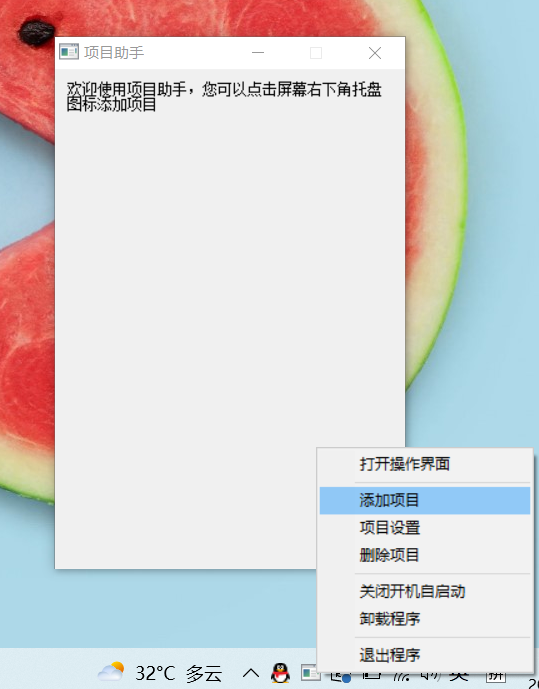
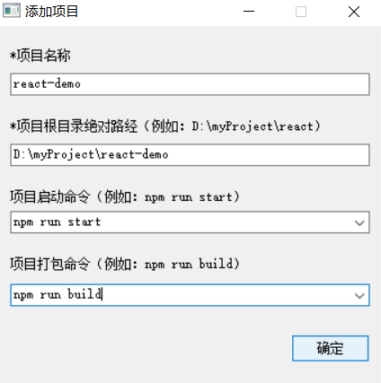
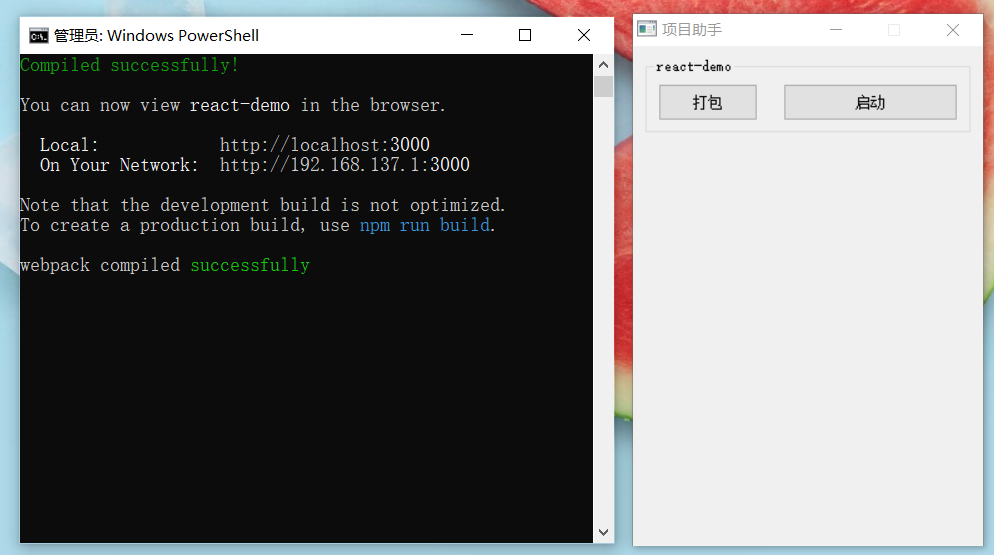

<h1 align="center">项目助手</h1>

使用AutoIt3开发的一款可以一键启动或打包项目的小工具

## 效果展示

</img>

</img>

</img>

</img>

## 项目亮点

- 可随时开启/关闭程序的开机自启动功能。
- 启用 OnEvent 模式，告别使用 while 循环来监听用户操作的方式。
- 在 UI/UE 方面做了很多优化，让自己或别人使用起来更加便捷、舒适。
- 函数式编程。

## 教程文档

[文档](https://www.jianshu.com/p/c7bd769f5a56)
